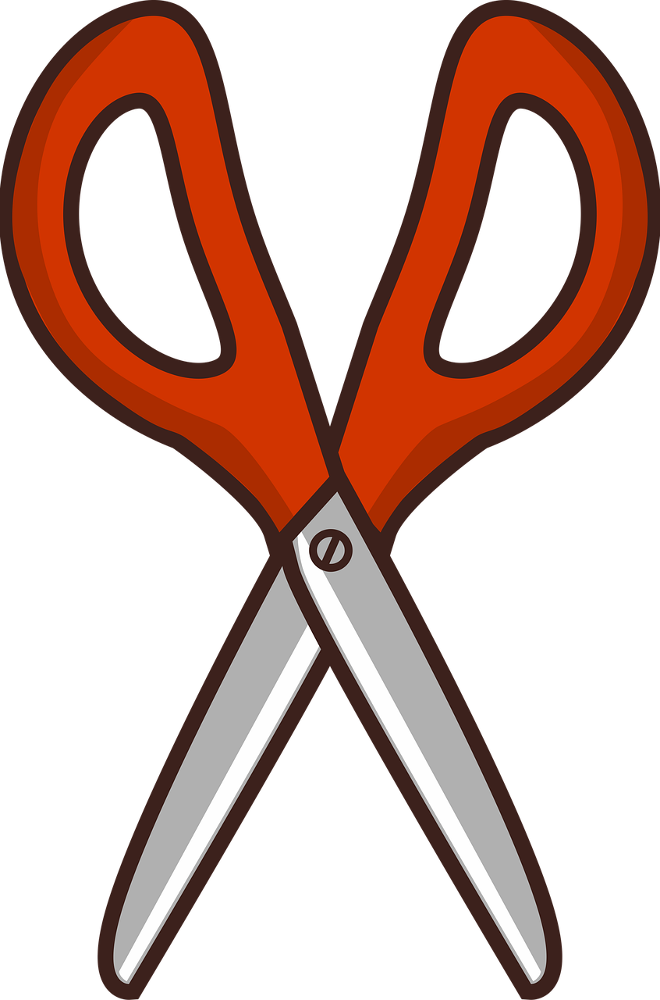
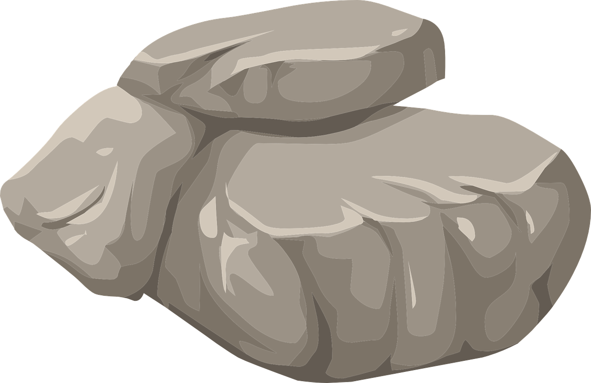
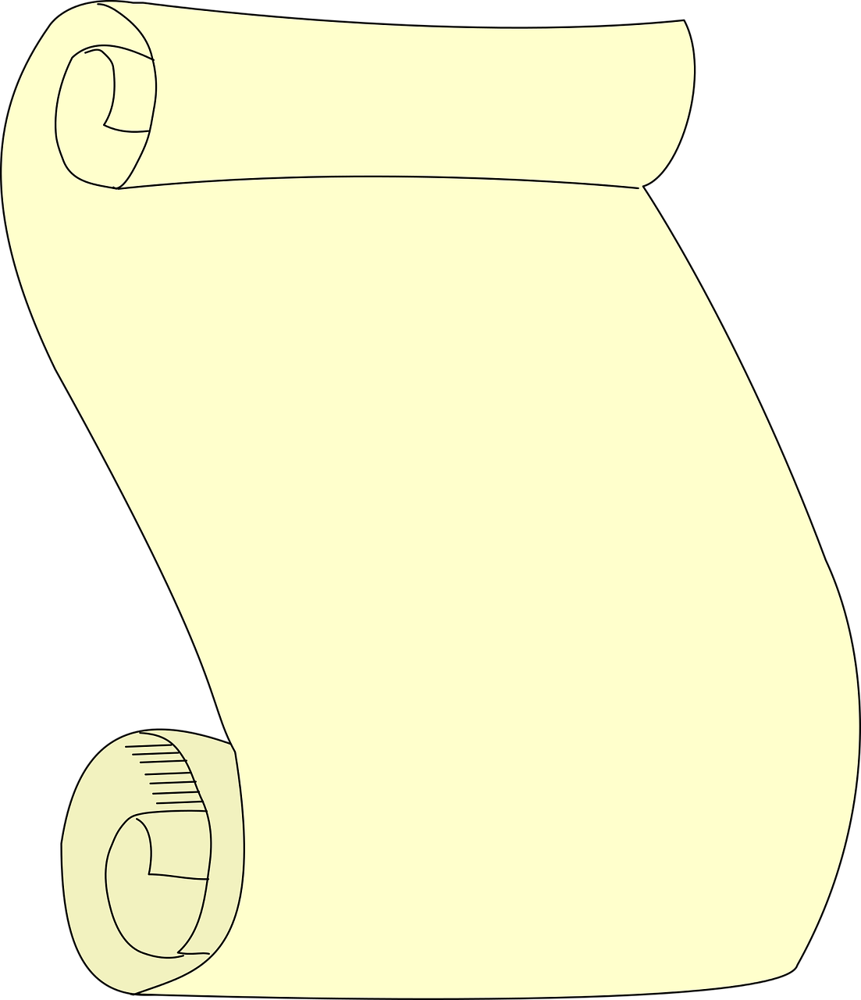

# Rock-Paper-Scissors

This is the solution to the [Rock-Paper-Scissors (console)][1] project of the JavaScript basics section in the [Foundations][2] course of The Odin Project.

[1]: https://www.theodinproject.com/lessons/foundations-rock-paper-scissors
[2]: https://www.theodinproject.com/paths/foundations/courses/foundations#javascript-basics

# Attributions

Here you can find the list of attributions for each of the resources used:

Image by <a href="https://pixabay.com/users/artsybeekids-392631/?utm_source=link-attribution&utm_medium=referral&utm_campaign=image&utm_content=5693652">Venita Oberholster</a> from <a href="https://pixabay.com//?utm_source=link-attribution&utm_medium=referral&utm_campaign=image&utm_content=5693652">Pixabay</a>

Image by <a href="https://pixabay.com/users/openclipart-vectors-30363/?utm_source=link-attribution&utm_medium=referral&utm_campaign=image&utm_content=576667">OpenClipart-Vectors</a> from <a href="https://pixabay.com//?utm_source=link-attribution&utm_medium=referral&utm_campaign=image&utm_content=576667">Pixabay</a>

Image by <a href="https://pixabay.com/users/openclipart-vectors-30363/?utm_source=link-attribution&utm_medium=referral&utm_campaign=image&utm_content=2024228">OpenClipart-Vectors</a> from <a href="https://pixabay.com//?utm_source=link-attribution&utm_medium=referral&utm_campaign=image&utm_content=2024228">Pixabay</a>
